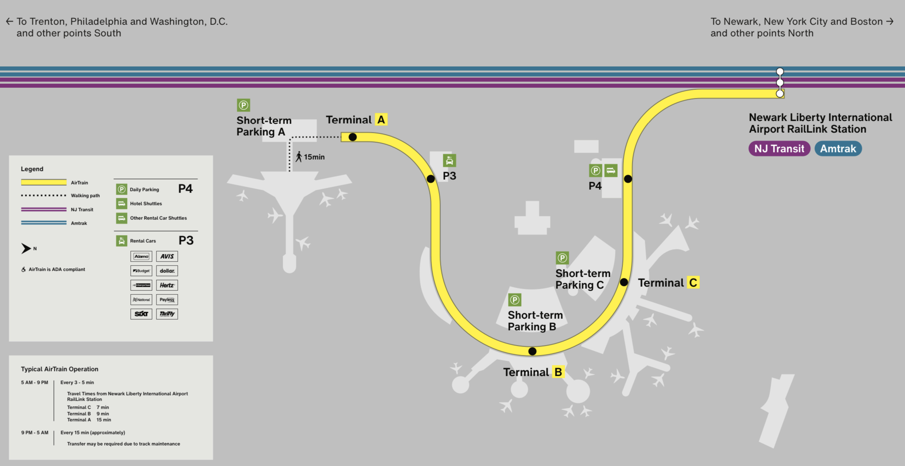

# Getting To/From The Airport

This section will help you figure out how to travel between Manhattan and the airport. How to get there depends
on which airport you are flying in/out of. 

Unless you want to pay a lot of money, **do not** take a taxi or Uber/Lyft to or from the airport. They're crazy expensive.
If you take train and/or bus, you'll pay between 3-10 dollars. If you take a taxi/Uber/Lyft, you're probably looking at upwards
of 50 bucks. 

I personally recommend using Google Maps to help you get to your specific destination, and to figure out which specific train/bus 
to take because you might have a few options. These are just general directions for how to get to Manhattan. For information on 
how to get around once you're in Manhattan, read my [Getting Around](gettingaround.md) page. 

There are three airports around New York City:

* John F Kennedy (JFK)
* LaGuardia (LGA)
* Newark (EWR)

## John F Kennedy (JFK)

### To Manhattan

To get to Manhattan from JFK, you'll be taking a series of trains. 

The first train is at the airport. It's called the AirTrain. The AirTrain goes between terminals at the airport
and also connects you to the subway system. There are two AirTrains you need to know about. One goes to the Jamaica 
subway station, and the other goes to the Howard Beach subway station. You can use either to get into Manhattan. If 
you're staying in Queens, it's probably better to take the Jamaica one. If you're staying in Brooklyn, probably take 
the Howard Beach one. If you're staying in Manhattan, it doesn't matter because both will take you where you need to go. 

###### Image courtesy of [The Port Authority of New York and New Jersey](https://www.panynj.gov/)

Once you get to the Jamaica or Howard Beach station, you'll need to pay fares as you exit the AirTrain station and enter 
the subway station. The AirTrain fare is $8.25, and you have to pay for it using a MetroCard (see [Getting Around](gettingaround.md)).
Subway fare is $2.75, and you can pay that with a MetroCard or by tapping your card/phone on the OMNY reader (see
[Getting Around](gettingaround.md) for more info).

You need to make sure you're getting on the subway train headed in the right direction. If you're at the Jamaica station, 
make sure to follow signs for the , , or 
trains toward Manhattan as shown in the map above. You can use Google Maps to figure out which one is best for where you
want to go. **Do not** get on a train for the Long Island Rail Road (LIRR). If you're at the Howard Beach station, you'll 
need to follow signs for the  train going towards Brooklyn and Manhattan, **not** towards the 
Rockaways. 

### To JFK

To go back to JFK, you'll need to make sure to get back off the subway and onto the AirTrain at either Howard Beach or Jamaica 
stations. It doesn't matter which one you choose if you're going to the airport.

## LaGuardia (LGA)

### To Manhattan

### To LaGuardia

## Newark (EWR)

I gotta be honest, Newark is my least favorite of all the NYC airports. It's big, old, and getting to Manhattan can be confusing.
That's my opinion, anyway. 

### To Manhattan

To get from Newark airport to Manhattan, you'll be taking a series of trains. There are multiple ways to get to Manhattan but I'm going to tell you the most straightforward  way.

The first train is at the airport. It's called the AirTrain. The AirTrain goes between terminals at the airport
and also connects you to the train to Manhattan. It's pretty simple. You just get on at your terminal, and get off at the Newark Liberty International 
Airport RailLink Station shown on the map below. 

###### Image courtesy of [The Port Authority of New York and New Jersey](https://www.panynj.gov/)

When you get to that station, you'll need to pay the fare. The fare is $8.25 and covers both the AirTrain trip that you just finished and the next train 
you'll be getting on to go to Manhattan. This is where it gets confusing, so pay attention. Fun fact, Newark Airport is in New Jersey, so you'll need to take an NJ Transit 
train to New York. From the AirTrain, you'll need to walk across the bridge and down the stairs (or elevator) to the platform. There you'll need to 
make sure to get on either the Northeast Corridor (red) or North Jersey (blue) Coast Line train heading towards New York Penn Station. You'll be getting
off the train at New York Penn Station. On the way there you'll pass through **Newark** Penn Station. **Do not** get off at this station, you need to continue on to the **New York** Penn Station.

Once you arrive at New York Penn Station, you'll be able to connect to the subway. I recommend using Google Maps
to figure out how to get from there to your destination. 

### To Newark

To get to Newark from Manhattan, you'll need to get on a NJ Transit Northeast Corridor or North Jersey Coast Line train at 
New York Penn Station. You can take the subway directly to this station. You need to make sure you buy a ticket 
specifically for going to the airport. If you have trouble with the ticket machines, you can go up to a ticket 
booth and ask for a ticket to the airport, and they'll help you out. Just like travelling to Manhattan from Newark,
your fare should be $8.25 and covers both your NJ Transit train trip and your ride on the AirTrain.

Make sure to get off the NJ Transit train at the Newark Liberty International Airport station. There you'll go upstairs
and cross the bridge into the AirTrain Station. The AirTrain can take you to whatever terminal you need, so make 
sure you know which terminal your flight is leaving from. 

###### Train letter bullets courtesy of [The Metropolitan Transportation Authority of New York](https://new.mta.info)
