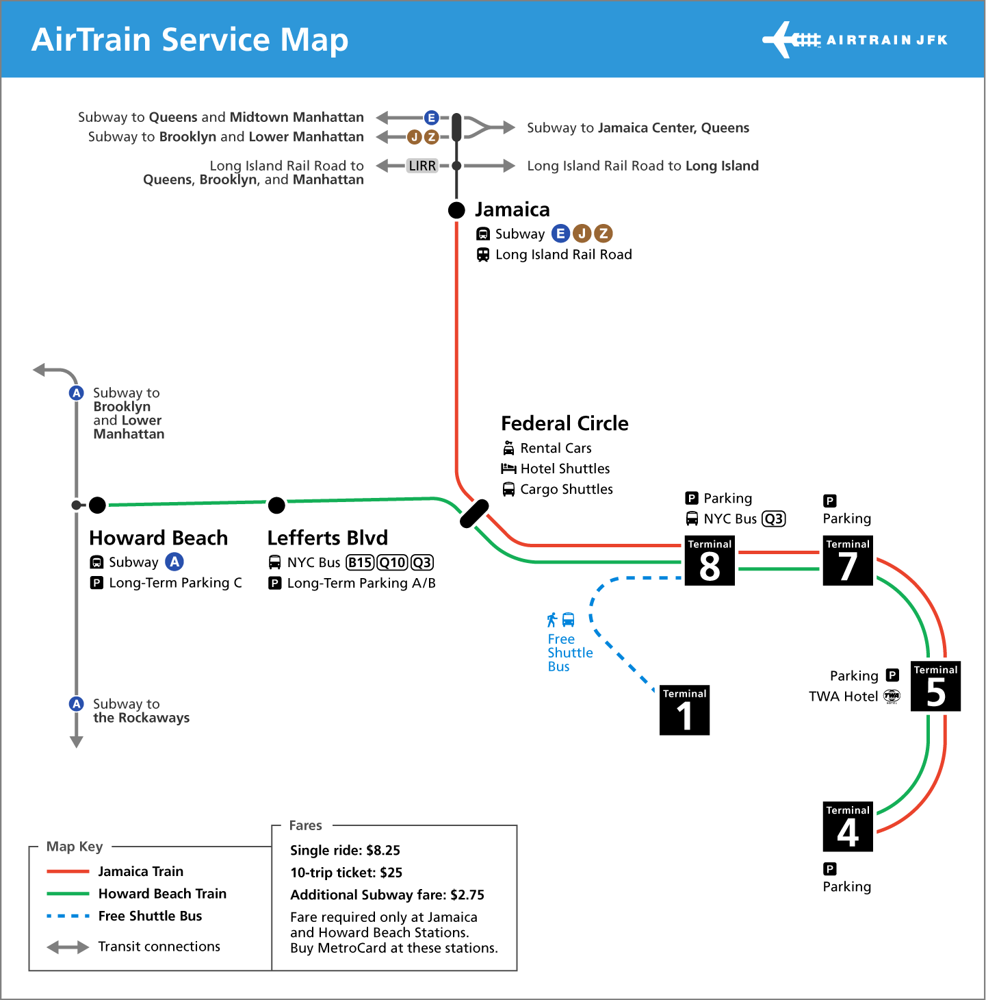

# Getting To/From The Airport

This section will help you figure out how to travel between Manhattan and the airport. How to get there depends
on which airport you are flying in/out of. 

I personally recommend using Google Maps to help you get to your specific destination. For information on how to
get around once you're in Manhattan, read my [Getting Around](gettingaround.md) page. 

There are three airports:

* John F Kennedy (JFK)
* LaGuardia (LGA)
* Newark (EWR)

## John F Kennedy (JFK)

To get to Manhattan from JFK, you'll be taking a series of trains. 

The first train is at the airport. It's called the AirTrain. The AirTrain goes between terminals at the airport
and also connects you to the subway system. There are two AirTrains you need to know about. One goes to the Jamaica 
subway station, and the other goes to the Howard Beach subway station. You can use either to get into Manhattan. If 
you're staying in Queens, it's probably better to take the Jamaica one. If you're staying in Brooklyn, probably take 
the Howard Beach one. If you're staying in Manhattan, it doesn't matter because both will take you there. 

###### Image courtesy [The Port Authority of New York and New Jersey](https://www.panynj.gov/)

Once you get to the Jamaica or Howard Beach station, you'll need to pay the fare for the AirTrain as you exit the AirTrain
station and enter the subway station. The fare is $8.25, and you have to pay for it using a MetroCard (see 
[getting around](gettingaround.md)). 

If you're at the Jamaica Station, make sure to follow signs for the  train going towards Queens and 
Manhattan so you get on the train going in the right direction.

If you're at the Howard Beach station, you'll need to follow signs for the  train going towards 
Brooklyn and Manhattan. 

To go back to JFK, you'll need to make sure to get back off the subway and onto the AirTrain at either Howard Beach or Jamaica 
stations. It doesn't matter which when you're going to the airport.

## LaGuardia (LGA)

## Newark (EWR)

###### Train letter bullets courtesy of [The Metropolitan Transportation Authority of New York](https://new.mta.info)
