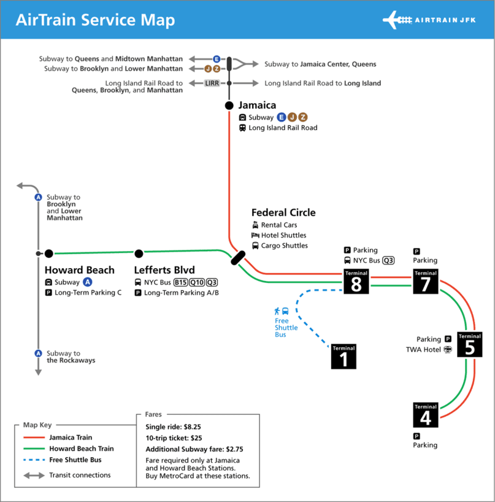

# Getting To/From The Airport

This section will help you figure out how to travel between Manhattan and the airport. How to get there depends
on which airport you are flying in/out of. 

I personally recommend using Google Maps to help you get to your specific destination. For information on how to
get around once you're in Manhattan, read my [Getting Around](gettingaround.md) spage. 

There are three airports:

* John F Kennedy (JFK)
* LaGuardia (LGA)
* Newark (EWR)

## John F Kennedy (JFK)

To get to Manhattan from JFK, you'll be taking a series of trains. 

The first train is at the airport. It's called the AirTrain. The AirTrain goes between terminals at the airport
and also connects you to the subway system. 

There are two trains. One goes to the Jamaica subway station, and the other goes to the Howard Beach subway station.
You can use either to get into Manhattan. If you're staying in Queens, it's probably better to take the Jamaica one. 
If you're staying in Brooklyn, probably take the Howard Beach one. 

###### Image courtesy [The Port Authority of New York and New Jersey](https://www.panynj.gov/)

## LaGuardia (LGA)

## Newark (EWR)
