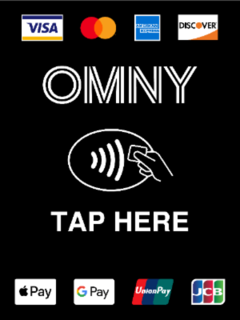

# How To Get Around

Getting around in NYC is way different than getting around where you live. You don't need a car, and it's actually a hassle to have one.

## Good Stuff To Know

Before I tell you how to get around, there are a couple things you need to know about New York.

New York is broken into 5 boroughs:

* Manhattan (where all the skyscrapers are, where you'll spend most of your time)
* The Bronx (cool, also known for being rough)
* Queens (where LaGuardia and JFK are)
* Brooklyn (south of Queens, has some interesting stuff)
* Staten Island (mostly residential, boring, can only get to it by ferry)

You'll probably spend most of your time in Manhattan. Going north in Manhattan is referred to as going "uptown". Going south in Manhattan
is referred to as going "downtown". You need to know this so you can make sure to get on trains and buses going in the right direction. 

## The Subway

The main way to get around NYC is on the subway. In Manhattan, every subway station is underground. In Queens, Brooklyn, and the Bronx, some
of them are above ground. 

Subway station entrances are usually located at corners of intersections. Sometimes they'll be a set of stairs with a green railing, and sometimes
they'll be part of a building. You might have to look around a little to find the entrance. 

### What The Colored Numbers and Letters Mean

The subway system is organized into colored lines, with specific train routes being designated by numbers or letters. There are reasons for that, 
but it's kind of complicated. Ask me sometime if you want to know. Within a colored line, not all trains stop at all stations. For example, in 
Manhattan the  train is considered an 'express' train and doesn't stop at all stops but runs along mostly the same route as the 
 and  trains (with exceptions). I recommend using Google Maps to help you figure out which train to take so you 
can get off where you need to. You can also find the subway map [here](https://new.mta.info/map/5256). The little letters and numbers next to each stop show 
which trains stop there. 

Sometimes you might need to transfer between trains to get where you're going. Subway stations will have signs pointing you in the right way to go. 

### How To Pay Your Fare

Subway fare costs $2.75. If you transfer between trains in a station or to a bus you won't have to pay an extra time. 

There are two ways to pay your fare: OMNY and MetroCard.

#### OMNY

OMNY is the easiest way to pay your fare on the subway. If you have a credit/debit card with the  
symbol on it, you can use your card to pay. You can also use Apple Pay and Google Pay.

One cool thing that OMNY does is it will stop charging you and you can ride for free once you ride 12 times,
(spending $33). To do this, you **have* to make sure to use the same card or device every time you tap. It won't
work if you're using multiple cards or devices. 

With OMNY, you don't have to use the ticket vending machines. Every turnstile will have a reader that looks like this:

Just tap your card or device on that reader. Enter the station through the turnstile as quickly as you can once the screen says 'GO', like this:

**Important:** You **need** to make sure go quickly through the turnstile once it says '**GO**'. The turnstiles lock again pretty fast after you pay, 
so if you miss it you'll have to pay again. 

###### Contactless payment symbol courtesy of [VISA](https://usa.visa.com/pay-with-visa/contactless-payments/contactless-payments.html)

###### OMNY reader screen images courtesy of [The Metropolitan Transportation Authority of New York](https://omny.info/omny-readers)

#### MetroCard

MetroCard is the traditional way to pay your subway fare. MetroCards look like this:

You have to buy a MetroCard at a MetroCard vending machine. You'll have to pay a $1 fee to get a new card, and there 
are multiple card types. You can put as much money as you want on a card. If you plan on putting more than $33 on there,
just go ahead and buy a week unlimited card. One thing you should know about the unlimited MetroCards is that you can only swipe 
an unlimited card once roughly every 20 minutes (unless you're transferring between bus/subway). They do that to make 
sure you don't try to use your card on more than one person at once. 

If you aren't in NYC for very long and/or won't be using the subway much, you can pre-pay a MetroCard. With the prepaid cards you can swipe more than once 
for multiple people if you want, unlike the unlimited MetroCards.

To use your MetroCard, swipe it on the turnstile with the black stripe facing you. If it asks you to swipe again, make sure to do it. Pay attention to whether 
it asks you to swipe again at the same turnstile or a different one. 

**Important:** As soon as the screen says '**GO**' you **need** to move through the turnstile quickly. If you don't go quickly enough, the turnstile will 
lock and you'll have to pay again. 

###### MetroCard courtesy of [The Metropolitan Transportation Authority of New York](https://omny.info/omny-readers)

## Bus

Buses run on most major streets in New York City. You can find the bus maps [here](https://new.mta.info/maps#new-york-city-bus-maps). Buses marked as Select Bus Service (SBS) means it's an express bus and only makes limited stops. 

Your fare costs the same as for the subway. If you are transferring from the subway your fare is free, but you'll 
still need to swipe or tap. You pay for it the same way, using OMNY or your MetroCard. For MetroCard, you'll 
need to put your card into the slot on the farebox instead of swiping it. For OMNY, you'll tap your card or 
device on a reader that looks the same as it does in the subway. 

### Things To Know If You've Never Ridden A Public City Bus

If you've never ridden a public city bus before (even in places that aren't NYC), here are a few things you'll need 
to know. 

The bus does not stop at every stop like a train does. If you want it to stop, you'll need to pull the yellow cord
running along the sides of the bus by the windows. There may also be 'stop' buttons on the poles you can hold on to.

## Ferry

You can use the NYC Ferry system to get to some places around New York. The ferry fare is $4 and can give you a good view of the NYC skyline. I definitely 
wouldn't try to use the ferry as your main way of getting around, but it's worth trying out for an experience. You can see routes, locations, and times at 
[ferry.nyc](https://www.ferry.nyc/).

Separate from the NYC Ferry system is the Staten Island Ferry which departs every 30 minutes from South Ferry, is free, and will take you to Staten Island.
Personally, though, I wouldn't bother to visit Staten Island on your first trip to NYC. Or on your second time. Or any time really. There's not much there. 
But now you know about it if you want. The Staten Island Ferry is a way to get a view of the Statue of Liberty, though. But if you do that make sure the
weather is good. You probably also should know it's not an up close view, but it is a view, and it is free 🤷‍♂️.

## Taxi, Uber/Lyft

Don't use them unless you are stranded somewhere not near the subway or you feel like you are in danger, especially on a bus or subway. They cost 
a lot more than you probably wanna pay, tbh. Plus if you're trying to use a taxi you have to try to flag one down, which kinda sucks. 

## Car

Don't rent one. Parking in NYC is awful and you're looking at upwards of $120 per day just for parking. Also, you don't want to deal with New York
traffic or tolls. 
